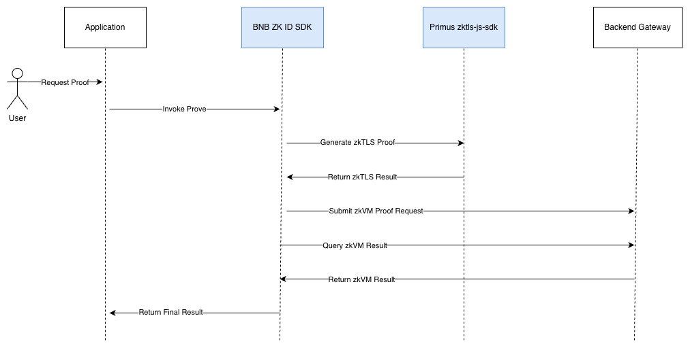

# 总体架构设计

## 文档定位

本文档是 `BNB-ZKID-SDK` 的总架构设计文档，也是进入实现前的最高优先级设计基线。

目标不是提前写完所有实现细节，而是先把下面这些内容冻结下来：

- SDK 到底解决什么问题
- SDK 与 Primus `zktls-js-sdk`、BNB ZK ID Gateway、后端 proving system 的关系
- 对外 facade API 应该长什么样，以及它未来如何落到内部 Gateway 集成层
- 模块边界、依赖方向和职责分工
- 数据流、状态流和错误流
- 实施顺序和每个阶段的退出标准

实现代码、细分接口和测试策略，都应以本文档为上位约束。

## 设计阶段原则

当前阶段采用 `contract-first` 策略：

1. 先冻结整体架构。
2. 再冻结 public API 和核心数据结构。
3. 再做 Gateway 集成实现。
4. 最后做 Primus 集成和端到端联调。

在这个阶段，避免以下行为：

- 先写 `HttpTransport` 细节，再反推 API
- 先写 Primus attestation 序列化，再补架构解释
- 先扩展 provider 细节，再定义稳定的抽象边界

## 背景与问题定义

这个 SDK 的目标，不是自己生成零知识证明，也不是替代 Primus SDK 或 Gateway。

它的职责是把“客户端应用调用 Primus zkTLS 能力”和“客户端应用调用 BNB ZK ID Gateway”这两段流程，收敛成一套稳定、清晰、可复用的 TypeScript 集成接口。

结合手写架构说明，SDK 的最终目标不是只暴露 Gateway 原子接口，而是对业务应用提供一个更高层的 facade：

- `init({ appId })`
- `prove(...)`

同时，在 facade 之下，保留一个更贴近 OpenAPI 的 `GatewayClient` 作为未来内部底层集成层：

- `getConfig()`
- `createProofRequest(...)`
- `getProofRequestStatus(...)`

从业务视角看，开发者需要完成的是：

1. 知道 Gateway 当前支持哪些 `provider`、`identityProperty`、schema 和业务约束。
2. 调用 Primus `zktls-js-sdk` 获取 zkTLS attestation。
3. 根据 `identityPropertyId` 和 provider 规则准备 `provingParams` 这类阈值输入。
4. 将 attestation、private data、public data 等内容组装为 Gateway 认可的 `ProofRequest`。
5. 提交 `POST /v1/proof-requests`。
6. 在 `prove(...)` 执行过程中通过进度回调向调用方返回状态，直到 `on_chain_attested` 或 `failed`。

因此，这个 SDK 的本质是一个“客户端集成编排 SDK”。

## 系统上下文

### 外部参与方

`Application`

- 使用本 SDK 的业务应用，可能是 Web 应用、钱包插件页或其他 TypeScript 客户端。

`Primus zktls-js-sdk`

- 负责发起 zkTLS attestation 相关流程。
- 负责生成 attestation 结果以及相关 private/public data。

`BNB ZK ID Gateway`

- 对外暴露 `GET /v1/config`
- 对外暴露 `POST /v1/proof-requests`
- 对外暴露 `GET /v1/proof-requests/{proofRequestId}`

`Internal Proving System`

- 位于 Gateway 后部，负责编排 prover、proof lifecycle 和上链流程。
- 不属于本 SDK 直接集成的对象。

`On-chain Identity Registry`

- 用于记录或承载最终上链结果。
- 当前不作为 public API 的直接查询对象。
- 其具体接入方式当前未冻结。

### 系统边界

本 SDK 直接负责的边界有三层：

1. 应用代码与 facade `BnbZkIdClient` 之间的产品 API 边界
2. facade 与未来底层 `GatewayClient` / `zkTLS Adapter` 之间的编排边界
3. SDK 与 Gateway / Primus / Registry 之间的集成边界

本 SDK 不直接承担：

- prover 编排
- proof 生命周期内部调度
- 上链 relayer
- Registry 合约交互

## 核心目标

### 必须满足

- 为业务应用暴露稳定的 facade `BnbZkIdClient`
- 在内部保留稳定的 `GatewayClient` 设计空间
- 为 Primus 集成定义单独的适配抽象
- 明确 `zkTls result -> ProofRequest` 的映射边界
- 让状态流转和错误模型可预测
- 保持浏览器运行时优先，但不把浏览器假设污染所有模块

### 明确不做

- 第一版支持所有 provider 的业务语义
- 第一版封装所有 Primus SDK 细节
- 第一版提供复杂插件系统
- 第一版对外隐藏所有协议概念

## 总体架构

### 分层视图

```text
Application
  ->
Facade API (BnbZkIdClient)
  ->
Workflow Layer
  ->
Gateway Client Layer / zkTLS Adapter Layer
  ->
Implementation Layer (deferred)
```

### 各层职责

`Public API`

- 面向应用开发者的稳定入口
- 暴露 `BnbZkIdClient` 类
- 暴露高层产品方法：`init / prove`

`Gateway Client Layer`

- 面向底层协议集成的稳定入口
- 保持与 Gateway OpenAPI 一一对应
- 不作为当前对外 public surface

`Workflow Layer`

- 负责定义跨组件的编排接口
- 例如：先初始化，再走 Primus，再提交 proof request，再跟踪状态直到完成
- 当前仓库已经落地最小可运行 workflow，用于串起 Primus、Gateway 和 progress callback

`Gateway Contract Layer`

- 定义 `/v1/config`、`/v1/proof-requests`、`/v1/proof-requests/{proofRequestId}` 的 TypeScript contract
- 定义 proof lifecycle status、ui status、error payload

`zkTLS Adapter Contract Layer`

- 定义 SDK 如何看待 Primus attestation 结果
- 定义 `collectAttestationBundle(...)` 的输入输出
- 定义 `identityPropertyId / provingParams -> templateId / attConditions` 的解析层
- 不在当前阶段承诺具体序列化实现

`Implementation Layer`

- 包括 HTTP transport、response parsing、runtime validation、Primus adapter 实现
- 当前阶段明确延后

## 关键模块划分

### `src/types/public.ts`

职责：

- 定义 facade `BnbZkIdClient` 的 public types
- 定义 client 的方法签名
- 定义稳定的输入输出结构

这是当前阶段最核心的文件之一。

### `src/client/`

职责：

- 承载 `BnbZkIdClient` 的默认形状
- 当前仓库里的 `BnbZkIdClient` 已经接入 runtime-configured workflow
- 未来内部 `GatewayClient` 不进入当前 public surface
- 内部保留不导出的 configured client，用于把 Primus adapter、Gateway client 和 workflow 串起来做实现验证

### `docs/`

职责：

- `architecture.md`：总架构和实现顺序
- `sdk-spec.md`：public contract 明细
- `harness.md`：当前 harness 分层、执行策略和验收计划

## 对外接口设计

### Facade Client

SDK 对业务应用暴露的第一层能力应固定为：

- `init({ appId })`
- `prove(input, options?)`

其中：

- `init({ appId })` 代表 SDK 级初始化，其中 `appId` 表示注册到 BNB ZK ID framework 的应用标识，并在失败时返回结构化错误信息
- `prove(...)` 代表从“业务证明意图”到“最终证明完成”这一整段编排
- `prove(...)` 的输入可包含 `provingParams`，用于传递 provider-specific 的数值分档阈值
- `options.onProgress` 用于在长任务执行过程中向调用方返回状态变化

### Gateway Client

SDK 在内部保留这一层能力：

- `getConfig()`
- `createProofRequest(input)`
- `getProofRequestStatus(proofRequestId)`

原因：

- 这三个接口与 Gateway API 一一对应
- 足够稳定，不依赖 Primus 实现细节
- 可以先完成 contract 设计，再决定 transport 和 validation 策略

### Primus Adapter

SDK 对 Primus 集成暴露的第一层抽象应固定为：

- `createPrimusZkTlsAdapter(config)`
- `collectAttestationBundle(input)`
- `resolvePrimusCollectInputForProve(registry, proveInput)`

当前仓库已经把这一层接入 public facade，但浏览器 live 模式仍依赖 Primus 扩展环境。

返回值至少应包含：

- `zkTlsProof`
- `attestation`
- `requestId`
- `privateData`

这里最关键的是：SDK 先定义“它期望从 Primus 得到什么”，而不是先定义“Primus 内部到底怎么工作”。

### Cross-SDK Workflow

高层 helper 可以继续作为内部实现设计存在，但当前不作为对外导出能力。

## 数据流设计

## 主要流程



上图更贴近产品视角，体现了：

- 应用只面向 SDK facade 调用
- SDK 内部再去调用 Primus、Gateway 和可能的 Registry

## 数据流设计

### 流程 A：读取配置

1. 应用创建 `client`
2. SDK 内部通过 `GatewayClient.getConfig()` 获取配置
3. SDK 拿到 `GatewayConfig`
4. 后续 `prove(...)` 根据配置决定 provider、property 和输入收集方式

### 流程 B：Gateway 原子调用

1. 应用已有 `zkTlsProof`，其中 `public_data` 是 attestation，`private_data` 是 `getPrivateData` 返回
2. 调用 `gatewayClient.createProofRequest(input)`
3. Gateway 返回 `proofRequestId`
4. 应用开始跟踪状态

### 流程 C：Primus 到 Gateway 的编排流程

1. 应用创建 Primus adapter
2. 调用 `collectAttestationBundle(...)`
3. 应用或 workflow helper 将结果映射为 `CreateProofRequestInput`
4. 调用 `gatewayClient.createProofRequest(...)`
5. 轮询 `gatewayClient.getProofRequestStatus(...)`

### 流程 D：Facade 视角的产品流程

1. 应用创建 `client`
2. 调用 `client.init({ appId })`
3. 应用按 `identityPropertyId` 组装可选的 `provingParams`
4. 调用 `client.prove(input, { onProgress })`
5. SDK 内部触发 Primus 和 Gateway 编排
6. SDK 在执行过程中通过 `onProgress` 向应用回传状态
7. `client.prove(...)` 最终返回 `on_chain_attested` 或 `failed`
8. 成功态结果必须包含 `walletAddress`、`providerId`、`identityPropertyId`

## 状态模型

`ProveStatus`

- `initialized`
- `data_verifying`
- `proof_generating`
- `on_chain_attested`
- `failed`

设计原则：

- 对外只暴露业务上能理解的少量状态
- `onProgress` 与最终 `ProveResult` 共享同一套核心状态语义
- SDK 不应在第一版向调用方暴露过多内部生命周期细节

## 错误模型

SDK 的错误分为两类：

### 设计期保留的 SDK 错误

- `ConfigurationError`
- `NotImplementedError`

### 运行期透传的 Gateway 错误

例如：

- `INVALID_REQUEST`
- `WHITELIST_REQUIRED`
- `PROVING_LIMIT_EXCEEDED`
- `INVALID_ZK_TLS_PROOF`
- `BINDING_CONFLICT`

设计原则：

- SDK 错误用于描述调用层和基础设施问题
- Gateway 错误用于描述业务和协议问题
- 两类错误不要混在一个枚举里

## 依赖规则

依赖方向必须保持单向：

`types -> client -> workflows`

`types -> zktls`

`types -> future transport implementation`

应避免：

- `types` 依赖具体 Primus 包
- `public API` 依赖具体 HTTP 库
- `workflow` 直接依赖未来的 transport 细节
- 让 Gateway payload 结构泄漏成 Primus adapter 的内部实现约束

## 运行时和打包策略

### 当前阶段

- 只保证类型层和 contract 层自洽
- 不承诺任何运行时实现
- 不承诺任何平台行为

### 下一阶段

- 优先浏览器场景
- ESM first
- 再评估是否需要兼容 Node 侧调用 Gateway

原因：

- Primus `zktls-js-sdk` 更接近浏览器集成场景
- Gateway client 本身可设计为环境无关
- 但两者组合 workflow 不一定天然跨运行时

## 实现分阶段计划

### Phase 0：冻结总架构

退出标准：

- 总架构文档完成
- public contract 已能覆盖主工作流
- 所有人对模块边界达成一致

### Phase 1：冻结 public types

退出标准：

- `src/types/public.ts` 稳定
- `sdk-spec.md` 与 types 对齐
- 状态枚举、进度事件结构、请求结构冻结

### Phase 2：实现 Gateway client

退出标准：

- `getConfig`
- `createProofRequest`
- `getProofRequestStatus`
- 基础 transport 与 parsing 完成

### Phase 3：实现 Primus adapter

退出标准：

- `collectAttestationBundle(...)` 可用
- Primus 结果映射规则明确
- 浏览器端 happy path 可执行

### Phase 4：实现 workflow 与 harness

退出标准：

- facade workflow 可运行
- README 示例可执行
- harness 可通过

## 当前冻结项

以下内容现在应视为已冻结：

- facade `BnbZkIdClient` 是当前唯一对外类入口
- facade 对外只暴露 `init({ appId })` 和 `prove(...)`
- `prove(...)` 支持 `onProgress`
- `ProveInput.clientRequestId` 作为长任务和并发任务的本地标识
- 未来内部存在 `GatewayClient` 与 Primus adapter 两层设计空间
- `CreateProofRequestInput` 的顶层字段结构
- `ProveStatus` 的枚举集合

以下内容当前不冻结：

- 具体 HTTP 实现
- 具体 schema parser 实现
- Primus attestation 的最终 proof 编码格式
- private/public data 的 provider 级细节转换逻辑
- 重试、超时和取消的最终实现方式

## 待确认问题

- Primus `zktls-js-sdk` 的主运行环境是否只考虑浏览器？
- `zkTlsProof.public_data` 的最终结构是否会被 Gateway 长期稳定接受？
- `zkTlsProof.private_data` 是否始终直接采用 `getPrivateData` 的原始返回结果？
- `businessParams` 是否需要按 provider/property 收敛成更细的 typed schema？
- `clientRequestId` 是否保持必填，还是允许 SDK 自动生成？
- 第一版是否需要支持自定义 transport 注入？

## 实施要求

从现在开始，任何实现工作都应先回答两个问题：

1. 这段实现对应本文档中的哪一个模块职责？
2. 这段实现是在填补“已冻结 contract”，还是在偷偷改变 contract？

如果是后者，应先修改文档，再修改代码。
